|  **ID** | **Structure** | **Formula** | **MMGBSA dG Bind** | **glide gscore** | **Available** |
|  ------ | ------ | ------ | ------ | ------ | ------ |
|  338 |  | C19H23N3O2 | -108.668 | -9.737 | Yes |
|  309 |  | C13H9O2 | -108.545 | -9.905 | Yes |
|  6 |  | C13H14NO4 | -108.444 | -9.254 | Yes |
|  628 |  | C17H15O4 | -108.18 | -10.339 | Yes |
|  509 |  | C11H9N2O2 | -108.048 | -9.539 | Yes |
|  538 |  | C12H8NO2 | -107.648 | -10.625 | Yes |
|  532 |  | C12H8NO2 | -107.477 | -11.703 | Yes |
|  135 |  | C16H10NO2 | -107.406 | -9.803 | Yes |
|  324 |  | C11H6NO5 | -107.28 | -11.552 | Yes |
|  508 |  | C11H8NO3 | -106.984 | -11.315 | Yes |
|  288 |  | C24H19FNO4 | -106.903 | -9.897 | Yes |
|  130 |  | C13H9O3 | -106.771 | -9.907 | Yes |
|  377 |  | C10H3Cl2O4 | -106.758 | -10.388 | Yes |
|  469 |  | C12H11N2O2 | -106.444 | -11.628 | Yes |
|  683 |  | C9H7Br2O3 | -106.177 | -11.428 | Yes |
|  395 |  | C10H3Br2O4 | -106.174 | -10.567 | Yes |
|  629 |  | C17H15O4 | -106.068 | -10.529 | Yes |
|  527 |  | C12H14NO2 | -105.851 | -9.863 | Yes |
|  405 |  | C14H17O4 | -105.786 | -9.723 | Yes |
|  73 |  | C12H13O5 | -105.745 | -9.484 | Yes |
|  44 |  | C9H7O3 | -105.744 | -9.639 | Yes |
|  572 |  | C11H7O4 | -105.449 | -9.468 | Yes |
|  534 |  | C12H16N2O2 | -105.37 | -10.4 | Yes |
|  379 |  | C13H15O2 | -105.231 | -10.505 | Yes |
|  140 |  | C17H18N3O2 | -104.893 | -11.705 | Yes |
|  593 |  | C15H12N2O2 | -104.82 | -10.233 | No |
|  387 |  | C12H8ClNO2S | -104.804 | -9.212 | No |
|  200 |  | C14H15NO5 | -104.674 | -11.164 | No |
|  120 |  | C11H13O3 | -104.655 | -9.634 | Yes |
|  547 |  | C11H13N2O2 | -104.633 | -10.348 | Yes |
|  263 |  | C11H10BrO4 | -104.632 | -10.82 | Yes |
|  588 |  | C12H15O4 | -104.565 | -9.364 | Yes |
|  337 |  | C19H22N3O2 | -104.412 | -9.59 | Yes |
|  619 |  | C10H10BrO2 | -104.308 | -11.483 | Yes |
|  681 |  | C9H7Cl2O2 | -104.171 | -11.12 | Yes |
|  363 |  | C14H12NO2 | -104.043 | -10.877 | Yes |
|  36 |  | C14H9O2 | -103.939 | -11.11 | Yes |
|  191 | 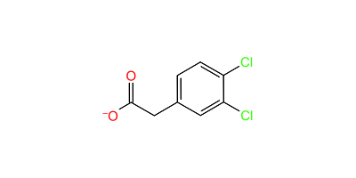 | C8H5Cl2O2 | -103.904 | -8.998 | Yes |
|  459 |  | C12H15NO3 | -103.878 | -9.443 | No |
|  398 |  | C19H31NO2 | -103.87 | -9.867 | Yes |
|  382 |  | C10H8BrO4 | -103.694 | -9.775 | Yes |
|  48 |  | C9H9O3 | -103.63 | -10.83 | Yes |
|  1 |  | C9H8NO3 | -103.625 | -10.344 | Yes |
|  249 |  | C11H12NO4 | -103.615 | -11.244 | Yes |
|  304 |  | C14H16Cl2NO4 | -103.572 | -9.649 | Yes |
|  88 |  | C9H9O2 | -103.566 | -9.645 | Yes |
|  362 |  | C20H15O2 | -103.561 | -10.005 | Yes |
|  141 |  | C17H19N3O2 | -103.559 | -9.46 | Yes |
|  287 |  | C24H19FNO4 | -103.517 | -9.875 | Yes |
|  401 |  | C12H10NO3 | -103.489 | -9.356 | Yes |
|  585 |  | C13H15O4 | -103.481 | -9.686 | Yes |
|  29 |  | C10H11O4 | -103.465 | -8.398 | Yes |
|  292 |  | C14H17FNO4 | -103.44 | -7.939 | Yes |
|  375 | 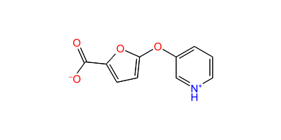 | C10H7NO4 | -103.429 | -9.475 | No |
|  480 |  | C12H16N2O2 | -103.422 | -9.895 | Yes |
|  313 |  | C12H13O2 | -103.392 | -9.806 | Yes |
|  453 |  | C9H5N2O2 | -103.369 | -11.145 | Yes |
|  528 |  | C12H15NO2 | -103.275 | -9.227 | Yes |
|  698 |  | C10H8FO3 | -103.248 | -9.779 | Yes |
|  444 |  | C10H6NO2 | -103.224 | -10.623 | Yes |
|  325 |  | C9H8FO2 | -103.21 | -11.407 | Yes |
|  526 | 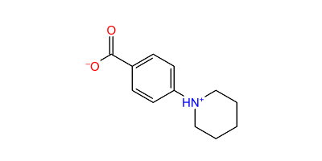 | C12H15NO2 | -103.208 | -9.898 | Yes |
|  100 |  | C10H7O4 | -103.139 | -10.898 | Yes |
|  635 |  | C10H6ClO3 | -103.074 | -9.961 | Yes |
|  413 |  | C12H13O4 | -103.012 | -9.647 | Yes |
|  144 |  | C11H12NO2 | -102.994 | -10.267 | Yes |
|  608 |  | C10H6ClNO2 | -102.963 | -10.151 | No |
|  670 |  | C10H6F3O2 | -102.946 | -10.236 | Yes |
|  633 |  | C12H15O5 | -102.942 | -9.42 | Yes |
|  312 |  | C10H11O3 | -102.92 | -9.126 | Yes |
|  125 |  | C11H7O2 | -102.918 | -11.2 | Yes |
|  584 |  | C15H9N2O2 | -102.877 | -10.735 | Yes |
|  56 |  | C10H9O3 | -102.853 | -10.725 | Yes |
|  129 | 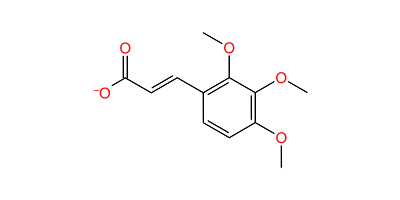 | C12H13O5 | -102.843 | -9.484 | Yes |
|  440 |  | C10H6NO2 | -102.795 | -11.248 | Yes |
|  473 |  | C11H13NO3 | -102.731 | -9.608 | Yes |
|  515 |  | C11H13NO2 | -102.726 | -9.337 | Yes |
|  607 |  | C10H5ClNO2 | -102.721 | -10.337 | Yes |
|  60 |  | C9H9O3 | -102.64 | -10.231 | Yes |
|  284 |  | C11H9O4 | -102.626 | -10.831 | Yes |
|  579 |  | C9H7ClN3O2 | -102.605 | -11.043 | Yes |
|  353 |  | C15H13O3 | -102.597 | -8.314 | Yes |
|  498 |  | C10H7N2O2 | -102.568 | -9.757 | Yes |
|  58 |  | C12H9O3 | -102.552 | -10.491 | Yes |
|  606 |  | C12H11N2O2 | -102.545 | -9.645 | Yes |
|  349 |  | C8H8NO2 | -102.494 | -10.894 | Yes |
|  438 |  | C10H6NO2 | -102.467 | -10.785 | Yes |
|  168 |  | C13H17O5 | -102.417 | -10.571 | Yes |
|  84 |  | C9H6BrO2 | -102.408 | -11.164 | Yes |
|  521 |  | C10H8N2O2 | -102.39 | -9.611 | No |
|  435 |  | C9H5N2O2 | -102.386 | -11.095 | Yes |
|  443 |  | C10H7NO2 | -102.363 | -10.841 | No |
|  587 |  | C12H13NO2 | -102.358 | -11.204 | No |
|  422 |  | C9H4ClO2S | -102.311 | -10.996 | Yes |
|  192 |  | C9H5BrFO2 | -102.281 | -10.888 | Yes |
|  368 |  | C7H7O3 | -102.28 | -10.67 | Yes |
|  599 |  | C13H13ClNO3 | -102.241 | -9.124 | Yes |
|  297 |  | C9H9O3 | -102.225 | -10.686 | Yes |
|  243 |  | C7H2Br3O3 | -102.169 | -11.543 | Yes |
|  201 |  | C9H6FO2 | -102.161 | -10.648 | Yes |
|  232 |  | C9H6FO2 | -102.161 | -10.648 | Yes |
|  516 |  | C10H6NO3 | -102.153 | -10.428 | Yes |
|  224 |  | C7H2Cl3O2 | -102.128 | -11.025 | Yes |
|  598 |  | C13H13ClNO3 | -102.119 | -11.154 | Yes |
|  341 |  | C8H6ClO2 | -102.077 | -11.005 | Yes |
|  134 |  | C10H11O3 | -102.063 | -10.805 | Yes |
|  481 |  | C12H17N2O2 | -102.06 | -9.505 | Yes |
|  318 | 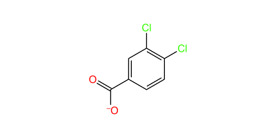 | C7H3Cl2O2 | -102.027 | -10.007 | Yes |
|  103 |  | C13H9N2O3 | -101.979 | -7.644 | Yes |
|  27 |  | C11H11O4 | -101.958 | -9.997 | Yes |
|  576 |  | C8H7N4O2 | -101.934 | -10.152 | Yes |
|  335 |  | C6H3BrNO2 | -101.891 | -10.068 | Yes |
|  399 |  | C13H17O2 | -101.856 | -10.063 | Yes |
|  72 |  | C12H13O5 | -101.836 | -9.069 | Yes |
|  483 |  | C12H8NO3 | -101.834 | -10.534 | Yes |
|  384 |  | C9H9O3 | -101.828 | -9.773 | Yes |
|  540 |  | C13H12NO2 | -101.779 | -10.666 | Yes |
|  539 |  | C12H9NO2 | -101.727 | -10.174 | No |
|  230 |  | C9H5F2O2 | -101.684 | -11.202 | Yes |
|  262 |  | C8H6IO3 | -101.66 | -10.339 | Yes |
|  225 |  | C7H3ClFO2 | -101.62 | -11.022 | Yes |
|  245 |  | C8H6BrO3 | -101.586 | -10.168 | Yes |
|  239 |  | C8H6FO3 | -101.58 | -10.827 | Yes |
|  704 |  | C12H7FNO3 | -101.518 | -9.923 | Yes |
|  146 |  | C9H6FO2 | -101.507 | -9.875 | Yes |
|  432 |  | C9H6FO4 | -101.482 | -11.192 | Yes |
|  472 |  | C11H12NO3 | -101.463 | -10.38 | Yes |
|  185 |  | C7H2ClF2O2 | -101.443 | -11.13 | Yes |
|  461 |  | C10H9O4 | -101.433 | -11.001 | Yes |
|  127 |  | C7H4BrO2 | -101.389 | -10.953 | Yes |
|  8 |  | C9H6ClO2 | -101.379 | -10.079 | Yes |
|  87 |  | C9H7O2 | -101.37 | -11.056 | Yes |
|  661 |  | C9H6BrO2 | -101.347 | -10.834 | Yes |
|  273 |  | C13H8F3N2O2 | -101.323 | -9.611 | Yes |
|  10 |  | C7H3ClNO4 | -101.276 | -10.687 | Yes |
|  580 |  | C9H8ClN3O2 | -101.257 | -10.705 | No |
|  601 |  | C12H10NO4 | -101.135 | -11.171 | Yes |
|  277 |  | C9H9O3 | -101.13 | -9.169 | Yes |
|  427 |  | C9H7O3 | -101.08 | -9.985 | Yes |
|  163 |  | C8H6FO3 | -101.076 | -10.896 | Yes |
|  293 |  | C14H17ClNO4 | -101.063 | -10.872 | Yes |
|  682 |  | C13H8FO2 | -101.049 | -9.436 | Yes |
|  703 |  | C8H6ClO2 | -101.039 | -10.622 | Yes |
|  490 |  | C9H7N2O2 | -101.019 | -10.96 | Yes |
|  271 | 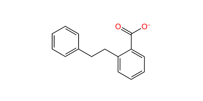 | C15H13O2 | -100.994 | -11.012 | Yes |
|  537 |  | C10H7N2O3 | -100.981 | -9.159 | Yes |
|  332 |  | C6H2Cl2NO2 | -100.979 | -10.849 | Yes |
|  148 |  | C9H8ClO3 | -100.959 | -10.825 | Yes |
|  613 |  | C6H7N2O2 | -100.949 | -10.15 | Yes |
|  107 |  | C10H9O2 | -100.934 | -9.173 | Yes |
|  229 |  | C9H5F2O2 | -100.928 | -10.815 | Yes |
|  20 |  | C8H5Cl2O3 | -100.875 | -8.947 | Yes |
|  279 |  | C13H9O3 | -100.859 | -10.292 | Yes |
|  478 |  | C10H8N2O2 | -100.858 | -10.322 | No |
|  523 |  | C8H5N2O2 | -100.857 | -10.955 | Yes |
|  357 |  | C7H5O5 | -100.823 | -9.5 | Yes |
|  411 |  | C13H13O5 | -100.81 | -10.293 | Yes |
|  558 |  | C13H7F2O3 | -100.743 | -11.024 | Yes |
|  14 |  | C8H6ClO2 | -100.741 | -8.926 | Yes |
|  486 |  | C11H8NO3 | -100.739 | -8.843 | Yes |
|  462 |  | C10H10NO3 | -100.71 | -10.607 | Yes |
|  111 |  | C12H11N2O3 | -100.661 | -10.826 | Yes |
|  586 |  | C12H12NO2 | -100.629 | -10.829 | Yes |
|  197 | 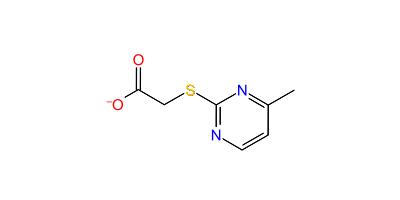 | C7H7N2O2S | -100.576 | -9.711 | Yes |
|  665 |  | C8H5F2O2 | -100.567 | -9.031 | Yes |
|  551 |  | C11H9N2O2 | -100.535 | -10.469 | Yes |
|  59 |  | C8H6NO4 | -100.511 | -9.396 | Yes |
|  518 |  | C8H5N2O2 | -100.511 | -10.629 | Yes |
|  615 |  | C5H6N3O2 | -100.509 | -10.729 | Yes |
|  240 |  | C15H11O2 | -100.417 | -10 | Yes |
|  495 |  | C10H7O3 | -100.411 | -10.431 | Yes |
|  634 |  | C9H6F3O4 | -100.384 | -10.474 | Yes |
|  294 |  | C14H17ClNO4 | -100.373 | -7.49 | Yes |
|  329 |  | C8H6ClO3 | -100.33 | -9.514 | Yes |
|  45 |  | C9H7O3 | -100.319 | -10.722 | Yes |
|  651 |  | C11H7F3NO3 | -100.268 | -11.321 | Yes |
|  484 |  | C12H9NO3 | -100.214 | -9.512 | No |
|  639 |  | C7H5ClNO2 | -100.206 | -9.292 | Yes |
|  340 |  | C7H4BrO4 | -100.184 | -11.096 | Yes |
|  426 |  | C7H4F3O3 | -100.163 | -11.039 | Yes |
|  164 |  | C8H6ClO3 | -100.156 | -11.221 | Yes |
|  343 |  | C8H6ClO3 | -100.156 | -11.221 | Yes |
|  15 |  | C7H4ClO3 | -100.134 | -9.191 | Yes |
|  390 |  | C9H8ClO4 | -100.114 | -10.478 | Yes |
|  396 |  | C13H15O3 | -100.104 | -10.475 | Yes |
|  541 |  | C12H8NO2 | -100.099 | -9.158 | Yes |
|  270 |  | C11H7O3 | -100.061 | -10.044 | Yes |
|  468 |  | C11H9N2O2 | -100.028 | -11.409 | Yes |
|  467 |  | C12H9O3 | -100.027 | -10.183 | Yes |
|  431 |  | C8H5O4 | -99.99 | -10.443 | Yes |
|  554 | 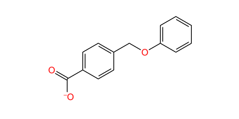 | C14H11O3 | -99.986 | -10.421 | Yes |
|  429 |  | C9H7O4 | -99.943 | -10.532 | Yes |
|  260 |  | C10H10BrO2 | -99.929 | -9.137 | Yes |
|  122 |  | C10H6NO2 | -99.913 | -10.688 | Yes |
|  496 |  | C12H8NO2 | -99.895 | -10.104 | Yes |
|  231 |  | C8H5F2O2 | -99.879 | -8.99 | Yes |
|  412 |  | C12H11O5 | -99.828 | -9.628 | Yes |
|  568 |  | C13H12ClN2O2 | -99.825 | -9.251 | Yes |
|  92 |  | C8H6ClO2 | -99.79 | -8.874 | Yes |
|  648 |  | C10H9O3 | -99.776 | -9.135 | Yes |
|  487 |  | C10H12N3O2 | -99.758 | -8.419 | Yes |
|  348 |  | C12H15O2 | -99.749 | -8.896 | Yes |
|  9 |  | C9H5ClNO2 | -99.699 | -10.532 | Yes |
|  531 |  | C8H4NO4 | -99.665 | -10.639 | Yes |
|  5 |  | C8H6BrO3 | -99.634 | -11.369 | Yes |
|  694 |  | C6H3ClNO2 | -99.627 | -9.983 | Yes |
|  2 |  | C15H9O2 | -99.61 | -11.185 | Yes |
|  280 |  | C15H9O2 | -99.61 | -11.185 | Yes |
|  308 |  | C7H4Cl2NO3 | -99.583 | -9.206 | Yes |
|  333 |  | C6H3Cl2NO2 | -99.572 | -10.448 | No |
|  61 |  | C10H11O2 | -99.513 | -9.519 | Yes |
|  533 |  | C12H9NO2 | -99.508 | -9.695 | No |
|  267 |  | C7H3ClFO2 | -99.506 | -9.934 | Yes |
|  482 |  | C12H17N2O2 | -99.484 | -9.653 | Yes |
|  281 |  | C15H9O2 | -99.48 | -11.022 | Yes |
|  492 |  | C11H8NO2 | -99.441 | -9.675 | Yes |
|  41 |  | C8H6FO2 | -99.436 | -9.054 | Yes |
|  136 |  | C14H11O2 | -99.428 | -7.24 | Yes |
|  199 |  | C14H15NO5 | -99.425 | -10.147 | No |
|  548 |  | C11H14N2O2 | -99.39 | -9.756 | No |
|  172 |  | C7H3Cl2O2 | -99.351 | -10.186 | Yes |
|  76 |  | C7H4BrO2 | -99.33 | -10.918 | Yes |
|  421 |  | C9H13O3 | -99.298 | -8.982 | Yes |
|  50 |  | C10H7NO3 | -99.285 | -10.495 | No |
|  149 |  | C6H3BrNO2 | -99.263 | -10.072 | Yes |
|  512 |  | C12H14NO3 | -99.183 | -11.184 | Yes |
|  252 |  | C12H10NO5 | -99.178 | -7.889 | Yes |
|  658 |  | C8H4F3O2 | -99.176 | -10.996 | Yes |
|  282 |  | C9H7BrNO3 | -99.113 | -9.474 | Yes |
|  233 |  | C7H3FIO2 | -99.111 | -10.691 | Yes |
|  524 |  | C8H6N2O2 | -99.099 | -9.939 | No |
|  503 |  | C8H5N2O2 | -99.088 | -10.948 | Yes |
|  573 |  | C8H7O3 | -99.066 | -11.325 | Yes |
|  675 |  | C14H17FNO4 | -99.054 | -9.514 | Yes |
|  290 |  | C18H20NO4 | -99.051 | -10.645 | Yes |
|  196 |  | C9H7O2 | -99.013 | -10.219 | Yes |
|  386 |  | C12H7ClNO2S | -98.986 | -9.52 | Yes |
|  626 |  | C10H6F3N2O2 | -98.985 | -11.134 | Yes |
|  256 |  | C8H4F3O3 | -98.95 | -10.461 | Yes |
|  67 |  | C10H8ClO3 | -98.933 | -9.898 | Yes |
|  636 |  | C10H5O4 | -98.919 | -10.111 | Yes |
|  246 | 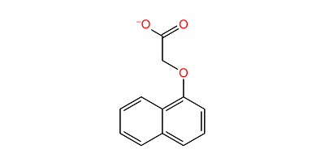 | C12H9O3 | -98.908 | -10.065 | Yes |
|  55 |  | C10H5O4 | -98.868 | -11.167 | Yes |
|  624 |  | C6HCl2FNO2 | -98.834 | -10.053 | Yes |
|  406 |  | C8H7O3S | -98.782 | -8.994 | Yes |
|  456 |  | C12H15NO3 | -98.755 | -9.287 | No |
|  428 |  | C9H7O3 | -98.685 | -10.09 | Yes |
|  555 |  | C10H6NO3 | -98.647 | -10.888 | Yes |
|  589 |  | C16H12NO3 | -98.642 | -8.884 | Yes |
|  663 |  | C6H4ClNO2 | -98.602 | -10.429 | No |
|  602 |  | C12H11N2O2 | -98.599 | -11.308 | Yes |
|  296 |  | C14H17ClNO4 | -98.591 | -9.069 | Yes |
|  272 |  | C12H9O2 | -98.556 | -10.796 | Yes |
|  664 |  | C8H6ClO3 | -98.552 | -8.464 | Yes |
|  75 |  | C9H5N2O3 | -98.508 | -10.776 | Yes |
|  424 |  | C11H8NO3 | -98.491 | -8.023 | Yes |
|  370 |  | C10H6NO3 | -98.468 | -10.488 | Yes |
|  678 |  | C13H14ClO2 | -98.457 | -10.385 | Yes |
|  291 |  | C14H17FNO4 | -98.402 | -10.022 | Yes |
|  303 |  | C11H12FO2 | -98.395 | -8.414 | Yes |
|  522 |  | C10H7N2O2 | -98.364 | -10.062 | Yes |
|  381 |  | C7H3Cl2O2 | -98.311 | -10.063 | Yes |
|  497 |  | C12H9NO2 | -98.301 | -10.713 | No |
|  161 |  | C9H9O3 | -98.295 | -8.909 | Yes |
|  359 |  | C9H9O3 | -98.295 | -8.909 | Yes |
|  52 |  | C10H7NO3 | -98.292 | -10.629 | No |
|  355 |  | C14H8NO2 | -98.288 | -10.972 | Yes |
|  707 |  | C11H8NO4 | -98.288 | -11.776 | Yes |
|  380 |  | C10H11O3 | -98.286 | -9.93 | Yes |
|  470 |  | C12H11N2O2 | -98.259 | -8.878 | Yes |
|  397 |  | C19H30NO2 | -98.256 | -9.373 | Yes |
|  529 |  | C11H8NO2 | -98.24 | -9.949 | Yes |
|  89 |  | C13H17O3 | -98.23 | -9.602 | Yes |
|  693 |  | C9H7N2O4 | -98.207 | -10.419 | Yes |
|  545 | 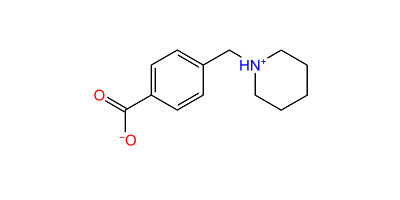 | C13H17NO2 | -98.202 | -9.946 | Yes |
|  562 |  | C10H10NO4 | -98.173 | -8.804 | Yes |
|  119 |  | C9H15O2 | -98.164 | -10.317 | Yes |
|  264 |  | C13H8F2NO4 | -98.164 | -8.916 | Yes |
|  680 |  | C12H11ClNO3 | -98.143 | -9.461 | Yes |
|  600 |  | C11H7FNO3 | -98.132 | -10.195 | Yes |
|  97 |  | C9H5Cl2O2 | -98.116 | -7.389 | Yes |
|  655 |  | C11H6Cl2NO3 | -98.092 | -9.372 | Yes |
|  404 |  | C13H11O5 | -98.082 | -11.213 | Yes |
|  420 |  | C9H13O3 | -98.069 | -10.689 | Yes |
|  611 |  | C6H3BrNO2 | -98.061 | -10.803 | Yes |
|  310 |  | C10H8BrO3 | -97.999 | -9.595 | Yes |
|  82 |  | C9H7O4 | -97.992 | -10.405 | Yes |
|  176 |  | C13H17O2 | -97.972 | -10.183 | Yes |
|  137 |  | C8H7O4 | -97.96 | -10.655 | Yes |
|  553 |  | C11H7N2O2 | -97.955 | -11.004 | Yes |
|  213 |  | C13H13ClFO2 | -97.946 | -9.811 | No |
|  620 |  | C10H11N2O2 | -97.911 | -11.095 | Yes |
|  241 |  | C13H17O2 | -97.907 | -10.183 | Yes |
|  24 |  | C9H9O4 | -97.879 | -10.689 | Yes |
|  673 |  | C7H6NO3 | -97.876 | -10.957 | Yes |
|  28 |  | C10H11O4 | -97.87 | -8.073 | Yes |
|  430 |  | C9H7O4 | -97.833 | -10.882 | Yes |
|  439 |  | C10H7NO2 | -97.83 | -10.676 | No |
|  513 |  | C12H15NO3 | -97.772 | -9.214 | Yes |
|  37 |  | C14H7O3 | -97.739 | -9.801 | Yes |
|  35 |  | C15H13O2 | -97.71 | -8.996 | Yes |
|  638 |  | C7H6ClNO3 | -97.703 | -9.831 | No |
|  622 |  | C9H6BrO3 | -97.696 | -10.409 | Yes |
|  574 |  | C8H7O3 | -97.657 | -10.809 | Yes |
|  286 |  | C7H2F3O3 | -97.654 | -11.216 | Yes |
|  157 |  | C6H10BrO2 | -97.653 | -10.048 | Yes |
|  113 |  | C8H6BrO2 | -97.642 | -8.638 | Yes |
|  40 |  | C8H6FO2 | -97.64 | -10.441 | Yes |
|  211 |  | C12H11ClFO2 | -97.586 | -10.584 | Yes |
|  501 |  | C10H12N2O3 | -97.571 | -10.028 | No |
|  106 | 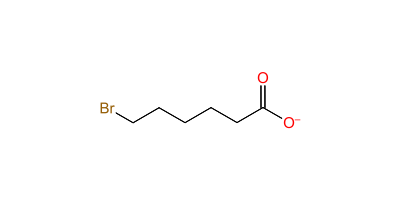 | C6H10BrO2 | -97.556 | -10.391 | Yes |
|  642 |  | C7H4F3NO2 | -97.456 | -9.492 | No |
|  305 |  | C14H16Cl2NO4 | -97.42 | -8.42 | Yes |
|  643 |  | C6H2Cl2NO2 | -97.41 | -10.188 | Yes |
|  445 |  | C9H7N2O2 | -97.388 | -10.516 | Yes |
|  583 |  | C11H10BrN2O3 | -97.343 | -9.587 | Yes |
|  505 |  | C10H9O3 | -97.333 | -10.974 | Yes |
|  627 | 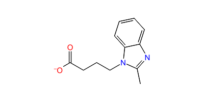 | C12H13N2O2 | -97.316 | -9.654 | Yes |
|  618 |  | C5H6N2O2 | -97.305 | -7.412 | No |
|  559 |  | C11H8ClN2O2 | -97.293 | -7.686 | Yes |
|  90 |  | C6H11O3 | -97.281 | -10.955 | Yes |
|  47 |  | C8H7O3 | -97.239 | -9.049 | Yes |
|  449 |  | C7H3N2O3 | -97.22 | -10.549 | Yes |
|  676 |  | C14H17FNO4 | -97.189 | -9.258 | Yes |
|  169 |  | C13H11O3 | -97.175 | -10.912 | Yes |
|  592 |  | C15H11N2O2 | -97.141 | -9.848 | Yes |
|  110 |  | C5H8BrO2 | -97.137 | -10.148 | Yes |
|  319 |  | C7H3ClFO2 | -97.127 | -10.32 | Yes |
|  178 |  | C10H10NO3 | -97.116 | -11.506 | Yes |
|  202 |  | C8H4F3O3 | -97.089 | -10.646 | Yes |
|  25 | 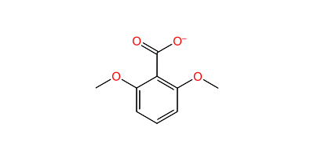 | C9H9O4 | -97.067 | -11.176 | Yes |
|  668 |  | C9H6F3O3 | -97.066 | -8.032 | Yes |
|  367 |  | C9H9O4 | -97.031 | -9.605 | Yes |
|  170 |  | C7H3Br2O3 | -96.976 | -10.492 | Yes |
|  183 |  | C7H6ClNO2 | -96.964 | -10.258 | No |
|  535 |  | C12H17N2O2 | -96.939 | -10.352 | Yes |
|  640 |  | C7H6ClNO2 | -96.899 | -10.052 | No |
|  637 |  | C7H5ClNO3 | -96.864 | -8.995 | Yes |
|  204 |  | C9H9O3 | -96.853 | -11.319 | Yes |
|  94 |  | C12H12ClO2 | -96.846 | -10.073 | Yes |
|  560 |  | C7H3Br2O2 | -96.757 | -10.434 | Yes |
|  687 |  | C13H14N2O2 | -96.752 | -9 | No |
|  603 |  | C6H6BrN2O2 | -96.738 | -10.037 | Yes |
|  373 |  | C8H6F3NO2 | -96.731 | -10.554 | No |
|  78 | 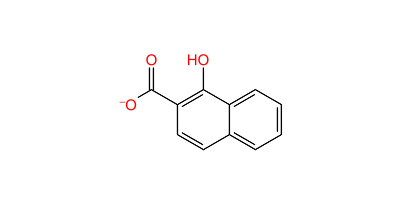 | C11H7O3 | -96.709 | -8.995 | Yes |
|  117 |  | C14H17O2 | -96.707 | -10.875 | Yes |
|  491 |  | C9H8N2O2 | -96.69 | -10.599 | No |
|  39 |  | C7H4FO2 | -96.648 | -10.295 | Yes |
|  244 |  | C13H8ClFNO3 | -96.645 | -9.528 | Yes |
|  145 |  | C11H13NO2 | -96.63 | -8.2 | Yes |
|  519 |  | C8H6N2O2 | -96.627 | -10.495 | No |
|  126 |  | C7H4ClO3 | -96.616 | -9.983 | Yes |
|  672 |  | C7H7NO2 | -96.573 | -10.271 | No |
|  434 | 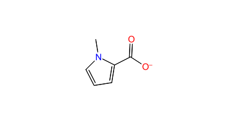 | C6H6NO2 | -96.555 | -10.302 | Yes |
|  142 |  | C8H6FO2 | -96.537 | -8.657 | Yes |
|  265 |  | C13H8F2NO4 | -96.51 | -9.104 | Yes |
|  7 |  | C13H14NO4 | -96.49 | -9.701 | Yes |
|  684 |  | C12H8ClO3 | -96.49 | -8.547 | Yes |
|  385 |  | C9H8BrO4 | -96.475 | -9.575 | Yes |
|  205 |  | C9H9O3 | -96.47 | -10.386 | Yes |
|  604 |  | C7H3ClN3O2 | -96.457 | -10.334 | Yes |
|  364 |  | C9H14NO3 | -96.428 | -9.692 | Yes |
|  514 |  | C11H12NO2 | -96.427 | -9.693 | Yes |
|  150 |  | C6H4BrNO2 | -96.42 | -10.148 | No |
|  685 |  | C12H5BrF3O3 | -96.383 | -10.664 | Yes |
|  210 |  | C13H14FO2 | -96.382 | -11.144 | Yes |
|  253 |  | C12H10NO5 | -96.367 | -10.209 | Yes |
|  666 |  | C8H7O3 | -96.352 | -8.002 | Yes |
|  499 |  | C10H7N2O2 | -96.342 | -11.247 | Yes |
|  13 |  | C7H3ClNO4 | -96.322 | -9.27 | Yes |
|  108 |  | C10H8F3O3 | -96.318 | -11.23 | Yes |
|  112 |  | C12H12N2O3 | -96.316 | -9.198 | No |
|  219 |  | C7H6NO2 | -96.279 | -10.11 | Yes |
|  575 |  | C14H13O3 | -96.272 | -9.612 | Yes |
|  193 |  | C9H5BrFO2 | -96.271 | -7.931 | Yes |
|  706 |  | C8H6ClO2 | -96.235 | -9.048 | Yes |
|  506 |  | C10H9O3 | -96.234 | -10.39 | Yes |
|  701 |  | C9H4F3O3 | -96.233 | -9.622 | Yes |
|  408 |  | C11H6BrO2 | -96.219 | -10.528 | Yes |
|  662 |  | C6H3ClNO2 | -96.207 | -10.146 | Yes |
|  203 |  | C9H7O4 | -96.203 | -10.844 | Yes |
|  250 |  | C11H12NO4 | -96.171 | -10.897 | Yes |
|  389 |  | C11H10NO3 | -96.157 | -9.069 | Yes |
|  274 |  | C13H9F3N2O2 | -96.145 | -11.444 | No |
|  543 |  | C9H7N2O2 | -96.143 | -10.548 | Yes |
|  463 |  | C10H11NO3 | -96.136 | -9.928 | Yes |
|  590 |  | C12H10F3N2O2 | -96.131 | -9.149 | Yes |
|  54 |  | C6H5NO2 | -96.122 | -10.223 | No |
|  299 | 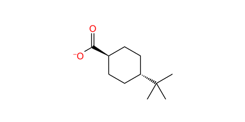 | C11H19O2 | -96.121 | -10.458 | Yes |
|  356 |  | C7H3Cl2O3 | -96.115 | -9.169 | Yes |
|  517 |  | C9H4BrO3 | -96.112 | -10.429 | Yes |
|  278 |  | C5H2ClO2S | -96.099 | -6.503 | Yes |
|  147 |  | C9H8ClO3 | -96.096 | -9.926 | Yes |
|  96 |  | C7H4BrO3 | -96.083 | -10.685 | Yes |
|  371 |  | C10H7NO3 | -96.067 | -8.363 | No |
|  186 |  | C8H6FO2 | -96.036 | -7.666 | Yes |
|  659 |  | C7H3F2O2 | -96.033 | -10.929 | Yes |
|  657 |  | C6H4ClNO2 | -96.026 | -9.549 | No |
|  464 |  | C10H11NO3 | -96.013 | -9.7 | Yes |
|  311 |  | C9H5ClFO2 | -95.997 | -10.957 | Yes |
|  77 |  | C7H5O2 | -95.985 | -8.589 | Yes |
|  254 |  | C9H9O3 | -95.949 | -9.629 | Yes |
|  544 |  | C10H8N3O2 | -95.94 | -10.923 | Yes |
|  690 |  | C10H8NO4 | -95.911 | -10.445 | Yes |
|  610 |  | C11H8FNO2 | -95.891 | -9.462 | No |
|  542 |  | C12H9NO2 | -95.868 | -9.566 | No |
|  621 |  | C10H12N2O2 | -95.858 | -10.777 | No |
|  641 |  | C7H3F3NO2 | -95.855 | -10.361 | Yes |
|  330 |  | C10H11O2 | -95.805 | -8.88 | Yes |
|  454 |  | C12H14NO3 | -95.775 | -8.646 | Yes |
|  625 |  | C6H2Cl2FNO2 | -95.77 | -10.474 | No |
|  38 |  | C7H4FO2 | -95.763 | -7.679 | Yes |
|  65 |  | C8H5Cl2O2 | -95.748 | -8.328 | Yes |
|  571 |  | C7H10NO3 | -95.747 | -11.091 | Yes |
|  64 |  | C7H7NO2 | -95.729 | -8.352 | No |
|  167 |  | C6H5NO3 | -95.69 | -10.529 | No |
|  162 |  | C9H9O3 | -95.688 | -9.561 | Yes |
|  360 |  | C9H9O3 | -95.688 | -9.561 | Yes |
|  71 | 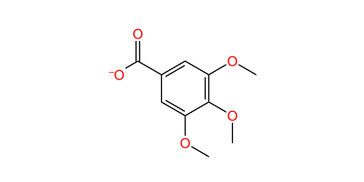 | C10H11O5 | -95.658 | -10.987 | Yes |
|  354 |  | C7H4BrO4 | -95.655 | -10.539 | Yes |
|  153 |  | C11H15NO2 | -95.62 | -11.287 | Yes |
|  180 |  | C7H13O2 | -95.615 | -10.789 | Yes |
|  550 |  | C10H12N2O2 | -95.594 | -9.057 | No |
|  418 |  | C9H13O3 | -95.584 | -9.192 | Yes |
|  336 |  | C6H4BrNO2 | -95.569 | -10.706 | No |
|  132 |  | C11H5F3NO3 | -95.565 | -10.686 | Yes |
|  650 |  | C11H10NO3 | -95.525 | -11.144 | Yes |
|  26 |  | C9H9O4 | -95.514 | -10.316 | Yes |
|  410 |  | C11H15O3 | -95.469 | -10.768 | Yes |
|  597 |  | C7H7NO3 | -95.467 | -10.307 | No |
|  605 |  | C7H4ClN3O2 | -95.441 | -10.542 | No |
|  316 |  | C11H7O4 | -95.439 | -11.007 | Yes |
|  18 |  | C7H3Cl2O3 | -95.364 | -9.612 | Yes |
|  289 |  | C18H20NO4 | -95.362 | -8.393 | Yes |
|  567 |  | C13H13N2O2 | -95.325 | -9.982 | Yes |
|  143 |  | C8H5ClFO2 | -95.324 | -8.44 | Yes |
|  236 |  | C9H6F3O3 | -95.305 | -9.067 | Yes |
|  582 |  | C10H7N2O3 | -95.295 | -7.777 | Yes |
|  93 |  | C12H13O2 | -95.289 | -10.286 | Yes |
|  674 |  | C7H7NO3 | -95.281 | -10.111 | No |
|  301 |  | C8H5Cl2O2 | -95.274 | -8.579 | Yes |
|  314 |  | C6H9O2 | -95.269 | -10.028 | Yes |
|  165 |  | C8H6ClO3 | -95.203 | -5.959 | Yes |
|  344 |  | C8H6ClO3 | -95.203 | -5.959 | Yes |
|  596 |  | C7H6NO3 | -95.199 | -9.877 | Yes |
|  32 |  | C9H10NO2 | -95.16 | -10.829 | Yes |
|  347 |  | C9H6FO2 | -95.128 | -9.642 | Yes |
|  392 |  | C12H11O5 | -95.104 | -8.969 | Yes |
|  33 |  | C9H11NO2 | -95.084 | -10.829 | Yes |
|  645 |  | C8H3F4O2 | -95.064 | -8.054 | Yes |
|  609 | 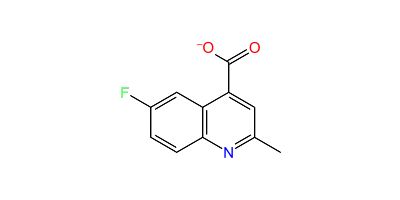 | C11H7FNO2 | -95.053 | -6.725 | Yes |
|  475 |  | C10H12N2O3 | -95.031 | -10.703 | No |
|  504 | 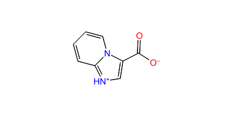 | C8H6N2O2 | -95.031 | -10.496 | No |
|  209 |  | C12H12FO2 | -94.978 | -9.66 | Yes |
|  49 |  | C10H6NO3 | -94.956 | -9.861 | Yes |
|  51 |  | C10H6NO3 | -94.956 | -9.861 | Yes |
|  616 |  | C5H4NO3 | -94.942 | -10.468 | Yes |
|  695 |  | C6H4ClNO2 | -94.938 | -10.08 | No |
|  268 |  | C7HF4O2 | -94.9 | -10.202 | Yes |
|  442 |  | C10H6NO2 | -94.827 | -9.418 | Yes |
|  80 |  | C9H9O3 | -94.809 | -10.044 | Yes |
|  631 |  | C11H14ClO2 | -94.809 | -10.191 | Yes |
|  520 |  | C10H7N2O2 | -94.804 | -9.306 | Yes |
|  697 |  | C6H4ClNO3 | -94.801 | -7.802 | No |
|  402 |  | C10H7O3 | -94.794 | -8.534 | Yes |
|  525 |  | C12H14NO2 | -94.716 | -9.705 | Yes |
|  450 |  | C5H4NO3 | -94.695 | -6.151 | Yes |
|  158 |  | C6H10BrO2 | -94.666 | -10.016 | Yes |
|  457 |  | C12H15NO3 | -94.663 | -9.601 | No |
|  53 |  | C6H4NO2 | -94.594 | -10.498 | Yes |
|  275 |  | C7H3ClFO2 | -94.586 | -10.126 | Yes |
|  669 |  | C11H6ClFNO3 | -94.583 | -10.273 | Yes |
|  295 |  | C14H17ClNO4 | -94.553 | -10.028 | Yes |
|  652 |  | C8H7N2O4 | -94.552 | -11.21 | Yes |
|  220 |  | C7H7NO2 | -94.544 | -9.658 | No |
|  569 |  | C11H5ClF3N2O2 | -94.532 | -11.33 | Yes |
|  403 |  | C10H7O3 | -94.53 | -8.903 | Yes |
|  57 |  | C11H7O2 | -94.494 | -10.75 | Yes |
|  474 |  | C10H11N2O3 | -94.479 | -9.513 | Yes |
|  617 |  | C5H5N2O2 | -94.474 | -10.677 | Yes |
|  322 |  | C8H10F3O3 | -94.464 | -7.689 | Yes |
|  251 |  | C6H5O3 | -94.442 | -10.649 | Yes |
|  46 |  | C11H7O3 | -94.424 | -10.573 | Yes |
|  17 |  | C7H3Cl2O2 | -94.422 | -10.566 | Yes |
|  66 |  | C10H10ClO2 | -94.36 | -10.751 | Yes |
|  139 | 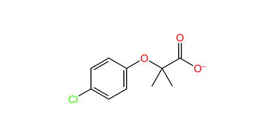 | C10H10ClO3 | -94.296 | -10.325 | Yes |
|  458 |  | C12H15NO3 | -94.275 | -9.066 | No |
|  34 |  | C15H13O2 | -94.271 | -9.957 | Yes |
|  248 |  | C10H13O2 | -94.233 | -9.317 | Yes |
|  677 |  | C13H14ClO2 | -94.225 | -7.545 | Yes |
|  466 |  | C7H9N2O2 | -94.209 | -9.496 | Yes |
|  447 |  | C3HN2O3 | -94.187 | -10.442 | Yes |
|  612 |  | C6H4BrNO2 | -94.174 | -10.047 | No |
|  342 |  | C10H11O2 | -94.069 | -8.418 | Yes |
|  212 |  | C13H13ClFO2 | -94.056 | -9.412 | Yes |
|  115 |  | C13H15O3 | -93.985 | -8.648 | Yes |
|  378 |  | C13H15O2 | -93.934 | -10.212 | Yes |
|  557 |  | C7H11O3 | -93.92 | -9.165 | Yes |
|  227 |  | C7H2ClF2O2 | -93.914 | -9.846 | Yes |
|  31 |  | C9H11NO2 | -93.909 | -10.697 | Yes |
|  104 |  | C10H6NO2 | -93.889 | -8.87 | Yes |
|  69 |  | C9H9O2 | -93.879 | -7.877 | Yes |
|  591 |  | C12H11F3N2O2 | -93.871 | -10.729 | No |
|  436 |  | C6H4NO2 | -93.829 | -10.374 | Yes |
|  208 |  | C12H12FO2 | -93.801 | -10.111 | Yes |
|  623 |  | C11H10N3O2 | -93.792 | -6.41 | Yes |
|  614 |  | C6H8N2O2 | -93.788 | -10.19 | No |
|  564 |  | C8H4F3O2 | -93.782 | -9.023 | Yes |
|  62 |  | C5H3N2O2 | -93.76 | -10.564 | Yes |
|  331 |  | C10H11O2 | -93.759 | -10.94 | Yes |
|  234 |  | C7H2F3O2 | -93.752 | -11.029 | Yes |
|  485 |  | C12H9N2O2 | -93.746 | -8.971 | Yes |
|  247 |  | C9H9O4 | -93.737 | -9.63 | Yes |
|  19 |  | C8H5Cl2O3 | -93.729 | -8.168 | Yes |
|  351 |  | C8H6IO2 | -93.723 | -8.145 | Yes |
|  376 |  | C11H11F3N3O2 | -93.714 | -9.652 | Yes |
|  350 |  | C8H9NO2 | -93.704 | -8.35 | No |
|  494 |  | C9H7O3 | -93.686 | -10.502 | Yes |
|  258 |  | C10H11O2 | -93.636 | -10.892 | Yes |
|  465 |  | C10H6NO3 | -93.615 | -8.458 | Yes |
|  22 |  | C7H5O4 | -93.605 | -10.487 | Yes |
|  328 |  | C8H6ClO3 | -93.595 | -7.926 | Yes |
|  116 |  | C13H14ClO2 | -93.578 | -9.994 | Yes |
|  536 |  | C12H17N2O2 | -93.578 | -9.811 | Yes |
|  194 |  | C7H6NO2 | -93.549 | -8.908 | Yes |
|  99 |  | C8H6ClO3 | -93.479 | -7.842 | Yes |
|  455 |  | C12H14NO3 | -93.474 | -9.967 | Yes |
|  644 |  | C6H3Cl2NO2 | -93.468 | -10.221 | No |
|  98 |  | C7H3Cl2O2 | -93.434 | -9.56 | Yes |
|  546 |  | C11H9N2O2 | -93.434 | -9.89 | Yes |
|  179 |  | C6H9Cl2O2 | -93.426 | -9.462 | No |
|  489 |  | C5H6N2O2 | -93.42 | -10.762 | No |
|  407 |  | C14H9O2 | -93.394 | -9.179 | Yes |
|  688 |  | C10H9Cl2O3 | -93.392 | -11.049 | Yes |
|  68 | 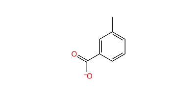 | C8H7O2 | -93.381 | -10.086 | Yes |
|  471 |  | C10H8N3O2 | -93.371 | -10.876 | Yes |
|  441 |  | C10H7NO2 | -93.369 | -9.911 | No |
|  549 | 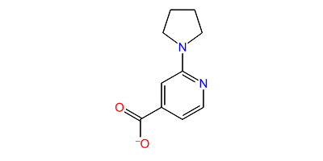 | C10H11N2O2 | -93.369 | -9.186 | Yes |
|  30 |  | C9H10NO2 | -93.357 | -10.527 | Yes |
|  689 |  | C7H9N2O2 | -93.332 | -10.211 | Yes |
|  414 |  | C9H13O3 | -93.33 | -8.761 | Yes |
|  171 |  | C7H2Cl3O2 | -93.319 | -9.133 | Yes |
|  660 |  | C6H5N2O2 | -93.303 | -9.703 | Yes |
|  511 |  | C11H9NO2 | -93.278 | -10.226 | No |
|  181 |  | C7H13O2 | -93.259 | -10.519 | Yes |
|  118 |  | C14H17O3 | -93.255 | -10.745 | Yes |
|  121 |  | C4H7O3 | -93.239 | -10.748 | Yes |
|  83 |  | C8H7O3 | -93.216 | -10.446 | Yes |
|  326 | 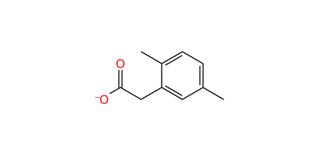 | C10H11O2 | -93.215 | -8.71 | Yes |
|  182 |  | C7H5ClNO2 | -93.176 | -9.889 | Yes |
|  307 |  | C5H7O3 | -93.15 | -9.733 | Yes |
|  235 |  | C9H6F3O3 | -93.123 | -10.411 | Yes |
|  700 |  | C8H4F3O3 | -93.039 | -9.65 | Yes |
|  500 |  | C10H11N2O3 | -93.016 | -10.7 | Yes |
|  415 |  | C9H13O3 | -92.999 | -10.82 | Yes |
|  334 |  | C8H6BrO3 | -92.933 | -7.988 | Yes |
|  109 |  | C10H8F3O3 | -92.927 | -10.596 | Yes |
|  595 |  | C11H9O4 | -92.902 | -7.853 | Yes |
|  448 |  | C8H10NO2 | -92.881 | -10.635 | Yes |
|  493 |  | C9H7O3 | -92.871 | -11.159 | Yes |
|  320 |  | C8H10F3O3 | -92.85 | -9.094 | Yes |
|  128 |  | C10H11O5 | -92.83 | -9.584 | Yes |
|  667 |  | C10H9O4 | -92.819 | -10.74 | Yes |
|  222 |  | C8H3F4O2 | -92.816 | -10.088 | Yes |
|  507 |  | C5H4NO3 | -92.771 | -9.848 | Yes |
|  419 |  | C9H13O3 | -92.758 | -7.658 | Yes |
|  81 |  | C9H9O3 | -92.752 | -10.105 | Yes |
|  255 |  | C9H9O3 | -92.679 | -10.081 | Yes |
|  238 |  | C10H11O4 | -92.664 | -8.239 | Yes |
|  479 |  | C9H6N3O2 | -92.657 | -8.731 | Yes |
|  12 |  | C7H3ClNO4 | -92.644 | -10.587 | Yes |
|  86 |  | C10H11O3 | -92.632 | -8.746 | Yes |
|  647 |  | C8H10F3O2 | -92.62 | -8.96 | Yes |
|  632 |  | C8H4NO3 | -92.611 | -9.259 | Yes |
|  361 |  | C3F5O2 | -92.605 | -10.227 | Yes |
|  502 |  | C10H12NO2 | -92.591 | -9.595 | Yes |
|  133 |  | C9H6F3O2 | -92.569 | -8.531 | Yes |
|  3 |  | C13H9O2 | -92.526 | -8.742 | Yes |
|  409 |  | C4Cl2NO2S | -92.505 | -8.55 | Yes |
|  215 |  | C5H8BrO2 | -92.503 | -10.601 | Yes |
|  114 |  | C10H9O2 | -92.42 | -10.605 | Yes |
|  699 |  | C8H6FO2 | -92.392 | -10.261 | Yes |
|  460 |  | C6H7N2O2 | -92.384 | -10.173 | Yes |
|  477 |  | C10H7N2O2 | -92.378 | -9.99 | Yes |
|  570 |  | C7H10NO3 | -92.37 | -10.267 | Yes |
|  11 |  | C7H3ClNO4 | -92.322 | -8.601 | Yes |
|  696 |  | C6H3ClNO3 | -92.292 | -10.221 | Yes |
|  151 |  | C9H6F3O2 | -92.29 | -8.249 | Yes |
|  352 |  | C8H6BrO3 | -92.24 | -10.691 | Yes |
|  446 |  | C5H3N2O2 | -92.172 | -10.63 | Yes |
|  566 |  | C11H6F3N2O2 | -92.163 | -8.962 | Yes |
|  228 |  | C7H3F2O2 | -92.156 | -10.276 | Yes |
|  257 |  | C4H9NO2 | -92.152 | -9.638 | Yes |
|  266 |  | C10H5O4 | -92.132 | -10.249 | Yes |
|  383 |  | C5H3N2O3 | -92.086 | -7.956 | Yes |
|  346 |  | C8H6ClO3 | -92.078 | -10.561 | Yes |
|  581 |  | C10H5O4 | -92.024 | -9.11 | Yes |
|  679 |  | C12H11ClNO3 | -92.009 | -10.641 | Yes |
|  437 |  | C6H5NO2 | -92.002 | -8.518 | No |
|  223 |  | C7H2F3O2 | -91.985 | -8.214 | Yes |
|  374 |  | C10H6NO4 | -91.984 | -11.249 | Yes |
|  702 |  | C8H5F2O3 | -91.975 | -10.133 | Yes |
|  656 |  | C6H3ClNO2 | -91.938 | -9.874 | Yes |
|  671 |  | C7H6NO2 | -91.935 | -10.225 | Yes |
|  423 |  | C10H9O4 | -91.933 | -10.507 | Yes |
|  315 |  | C7H7O3 | -91.93 | -9.757 | Yes |
|  155 |  | C14H17O4 | -91.907 | -8.937 | Yes |
|  21 |  | C7H5O4 | -91.906 | -10.703 | Yes |
|  358 | 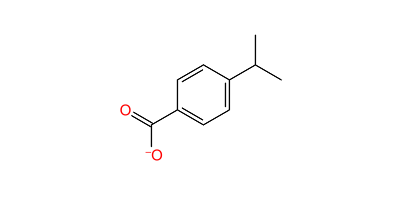 | C10H11O2 | -91.859 | -9.975 | Yes |
|  156 |  | C7H5O5 | -91.801 | -10.607 | Yes |
|  198 |  | C8H5F2O2 | -91.795 | -7.491 | Yes |
|  476 |  | C10H7N2O2 | -91.623 | -10.62 | Yes |
|  692 |  | C9H13N2O2 | -91.621 | -9.455 | Yes |
|  218 |  | C7H3F2O2 | -91.491 | -9.136 | Yes |
|  226 |  | C5H4F3O2 | -91.429 | -7.686 | Yes |
|  124 |  | C7H3ClFO2 | -91.422 | -9.933 | Yes |
|  691 |  | C9H13N2O2 | -91.396 | -10.412 | Yes |
|  123 |  | C3H2ClO2 | -91.382 | -10.154 | Yes |
|  269 |  | C7H3BrFO2 | -91.356 | -6.416 | Yes |
|  425 |  | C6H6NO3 | -91.323 | -10.376 | Yes |
|  23 |  | C7H5O4 | -91.299 | -10.702 | Yes |
|  578 |  | C7H7NO3 | -91.212 | -10.367 | No |
|  259 |  | C10H11O2 | -91.167 | -7.826 | Yes |
|  85 |  | C5H3N2O4 | -91.13 | -8.985 | Yes |
|  561 |  | C10H10NO4 | -91.061 | -8.487 | Yes |
|  488 |  | C5H5N2O2 | -90.997 | -10.425 | Yes |
|  510 |  | C11H8NO2 | -90.931 | -10.645 | Yes |
|  705 |  | C12H8FNO3 | -90.914 | -10.273 | No |
|  214 |  | C4H6BrO2 | -90.886 | -9.742 | Yes |
|  345 |  | C8H6ClO3 | -90.864 | -10.453 | Yes |
|  366 |  | C5H2BrO3 | -90.798 | -10.407 | Yes |
|  552 | 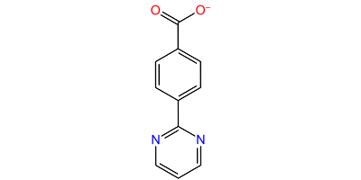 | C11H7N2O2 | -90.757 | -8.905 | Yes |
|  242 |  | C13H17O2 | -90.74 | -10.955 | Yes |
|  184 |  | C7H2F3O2 | -90.71 | -8.865 | Yes |
|  154 |  | C14H17O4 | -90.687 | -8.823 | Yes |
|  221 |  | C8H5F2O2 | -90.638 | -7.79 | Yes |
|  417 |  | C9H13O3 | -90.61 | -8.453 | Yes |
|  306 |  | C5H7O3 | -90.57 | -10.83 | Yes |
|  577 |  | C7H6NO3 | -90.506 | -8.959 | Yes |
|  300 |  | C9H2F5O2 | -90.381 | -10.811 | Yes |
|  74 |  | C7H11O2 | -90.375 | -10.311 | Yes |
|  216 |  | C5H8BrO2 | -90.351 | -10.485 | Yes |
|  177 |  | C13H17O2 | -90.331 | -7.8 | Yes |
|  321 |  | C8H10F3O3 | -90.314 | -9.654 | Yes |
|  372 |  | C8H5F3NO2 | -90.236 | -9.782 | Yes |
|  138 |  | C8H4F3O2 | -90.084 | -9.875 | Yes |
|  452 |  | C5H4NO3 | -90.015 | -9.876 | Yes |
|  187 |  | C4H5Br2O2 | -89.999 | -10.406 | Yes |
|  298 |  | C11H19O2 | -89.801 | -9.061 | Yes |
|  166 |  | C6H4NO3 | -89.751 | -8.755 | Yes |
|  195 |  | C7H7NO2 | -89.696 | -10.336 | No |
|  175 |  | C3H4ClO2 | -89.683 | -10.526 | Yes |
|  388 |  | C7H7O3 | -89.683 | -8.912 | Yes |
|  530 |  | C10H7N2O3 | -89.612 | -10.385 | Yes |
|  4 |  | C8H6BrO3 | -89.592 | -10.039 | Yes |
|  594 |  | C9H6NO3 | -89.556 | -7.987 | Yes |
|  105 |  | C11H13O2 | -89.51 | -10.479 | Yes |
|  70 |  | C2Br3O2 | -89.473 | -9.897 | Yes |
|  190 |  | C4H5Br2O2 | -89.45 | -7.59 | Yes |
|  173 |  | C7H3F2O2 | -89.39 | -10.33 | Yes |
|  565 |  | C6H4F3N2O2 | -89.361 | -10.154 | Yes |
|  276 |  | C8H7O4 | -89.34 | -10.189 | Yes |
|  686 |  | C13H13N2O2 | -89.266 | -9.366 | Yes |
|  285 |  | C7HClF3O2 | -89.237 | -7.004 | Yes |
|  188 |  | C4H5Br2O2 | -89.228 | -7.606 | Yes |
|  42 |  | C7H5O3 | -89.094 | -10.431 | Yes |
|  653 |  | C6H4NO4 | -89.082 | -8.208 | Yes |
|  630 |  | C11H14BrO2 | -88.983 | -9.938 | Yes |
|  91 |  | C8H6BrO2 | -88.88 | -7.908 | Yes |
|  237 |  | C4H2F3O2 | -88.781 | -10.016 | Yes |
|  217 |  | C7H2F3O2 | -88.763 | -10.405 | Yes |
|  654 |  | C6H5NO4 | -88.741 | -10.012 | No |
|  174 |  | C3H4ClO2 | -88.667 | -8.841 | Yes |
|  365 |  | C2Cl3O2 | -88.493 | -9.993 | Yes |
|  416 |  | C9H13O3 | -88.482 | -10.269 | Yes |
|  206 |  | C8H5F2O2 | -88.419 | -7.946 | Yes |
|  649 |  | C10H9O3 | -88.315 | -9.964 | Yes |
|  451 |  | C4H2NO3 | -88.282 | -8.75 | Yes |
|  16 |  | C2HCl2O2 | -88.141 | -8.972 | Yes |
|  283 |  | C8H3F4O2 | -87.583 | -10.553 | Yes |
|  556 |  | C5H2BrO3 | -87.522 | -10.257 | Yes |
|  317 |  | C4H5Br2O2 | -87.366 | -7.61 | Yes |
|  261 |  | C10H10BrO2 | -87.282 | -8.602 | Yes |
|  189 |  | C4H5Br2O2 | -87.046 | -10.806 | Yes |
|  159 |  | C5H9O2 | -86.694 | -9.292 | Yes |
|  131 |  | C8H6ClO2 | -86.672 | -8.193 | Yes |
|  393 |  | C12H11O5 | -86.553 | -8.321 | Yes |
|  369 |  | C6H5O3 | -86.171 | -10.072 | Yes |
|  302 |  | C8H3F4O2 | -86.041 | -10.267 | Yes |
|  101 |  | C4H6BrO2 | -85.529 | -9.519 | Yes |
|  433 |  | C5H3O3 | -85.217 | -9.304 | Yes |
|  79 | 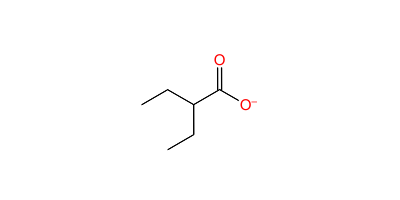 | C6H11O2 | -84.648 | -7.168 | Yes |
|  394 |  | C12H11O5 | -84.188 | -9.545 | Yes |
|  339 | 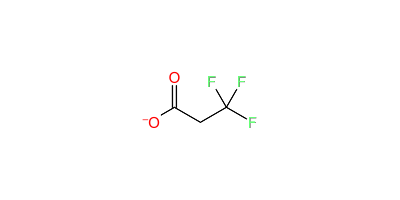 | C3H2F3O2 | -83.802 | -8.199 | Yes |
|  95 |  | C2HF2O2 | -83.29 | -10.04 | Yes |
|  391 |  | C12H11O5 | -83.222 | -9.297 | Yes |
|  327 |  | C6H7O2 | -82.859 | -7.878 | Yes |
|  102 |  | C4H6BrO2 | -82.045 | -9.417 | Yes |
|  160 |  | C5H9O2 | -81.785 | -7.56 | Yes |
|  63 |  | C7H6NO2 | -81.679 | -9.545 | Yes |
|  646 |  | C8H10F3O2 | -80.22 | -8.542 | Yes |
|  43 |  | C2O4 | -79.37 | -8.788 | Yes |
|  152 |  | C11H14NO2 | -76.142 | -7.699 | Yes |
|  207 |  | C10H5F6O2 | #N/A | #N/A | Yes |
|  323 |  | C8H10F3O3 | #N/A | #N/A | Yes |
|  400 |  | C16H23O3 | #N/A | #N/A | Yes |
|  563 |  | C9H3F6O2 | #N/A | #N/A | Yes |
